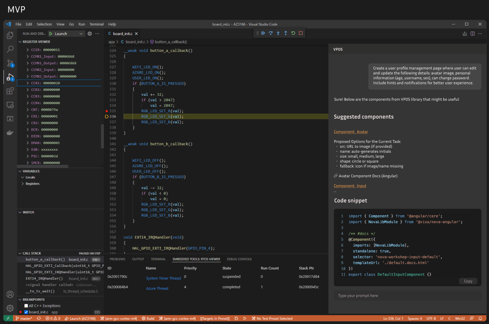
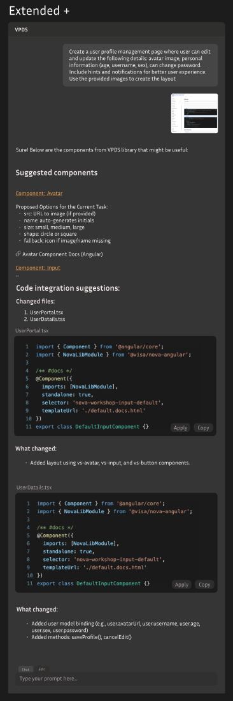

## Approach and technical choices
**The plan:**

1. Come up with a list of critical mvp features
2. Decide on the best format for usability (web app/extension)
3. Create a couple of designes (MVP and extended view)
4. Fill the gaps (check how to create basic extension)
5. Implement


**Technical choices:**

1. React application built with Vite
_Reason_: 

- no need for server side rendering for the VS Code extension
- Vite is much more performant (optimized production builds, uses ES modules by default, fast hot realoading)

2. Bun package manager

- performance
- all-in-one toolkit

3. Extension format

I consider the extension to be the best way from the UX perspective, it is integrated into your workflow and it takes you 1-2 clicks to open it and start working

## UI/UX

The extension was create in a form of a chat window, with a form to submit a prompt and a chat window to display the response.

Some basic features include:
1. Disabling a submit button while waiting for the response
2. Creating a new chat
3. Copy the generated code snippet
4. Parsing markdown

Check all designes [here](https://www.figma.com/design/S04uLs3Iw4mDwPVM8Lc713/Visa?node-id=0-1&t=3AD9YeKaxKjR3Pf2-1)

MVP:



Extended:




## Assumptions and shortcuts

1. The server response is a markdown string (most frequent LLM output)
2. Server responses are hardcoded
3. Only dark theme is supported

## Next steps

1. Chat and Edit mode ("edit" mode allows project edits)
2. Multimodality or integrating Figma mcp. Help model to understand the context better
3. Syntax highlighting
4. Chat history
5. Proper prompting (for better structured outputs)

## Use of AI

1. Used to write a function for link replacement inside of an index.html (frontend build) for smooth integration with a webView(extension component)
2. Proposed using startTransition while dispatching a form action that cleans the state
3. Adviced a good approach for debugging the extension

## Running the extension

1. Install dependencies inside vpds folder:

```
bun install
```

2. Install dependencies inside vpdsui folder:

``` cd vpdsui
    bun install
```

3. Build React frontend:

```cd ../
   bun run build-ui 
```

4. Compile the extension:

``` 
bun compile 
```

5. Run extension in a debug mode (F5 or Fn + F5)